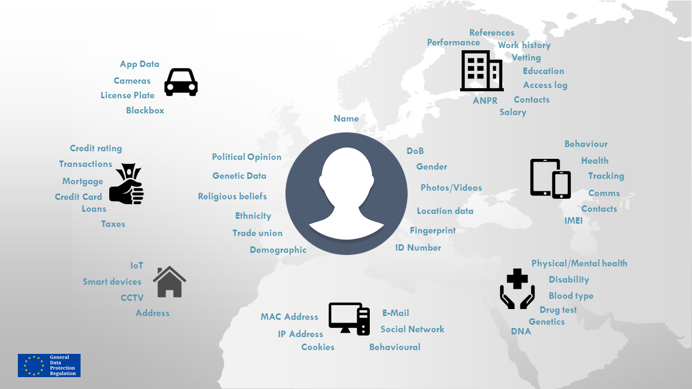

# What is Personal Data?
The GDPR does define what personal data is with-in Article 4 and thru Recitals 15,26,28,29,30,31,34,35,36,37. To be precise the definition is:
> ‘***personal data***’ means **any information** relating to an identified or identifiable natural person (‘*data subject*’); an identifiable natural person is one who can be identified, directly or indirectly, in particular by reference to an identifier such as a name, an identification number, location data, an online identifier or to one or more factors specific to the physical, physiological, genetic, mental, economic, cultural or social identity of that natural person

To get an extended clarification of personal data, reading the recitals is important. The recitals expand greatly on the various factors that can be interpreted as personal data and thus used to identify a data subject.

The GDPR also introduces the concept that some personal data is more sensitive and thus more restrictive in terms of processing than other types.

The work done here has tried to breakdown all the possible items that could be used in some form to identify a Data Subject.

## Personal Data
The GDRP defines personal data as any information relating to an identified or identifiable natural person or Data Subject. Traditionally, PII (Personally Identifiable Information) has set the standard for most enumarations of personal data attributes. This is no longer enough due to the nature of anything that could be used to identify a person.

## Sensitive Personal Data
The GDPR also defines some  special types of personal data that will have more stringent data protection controls in this statement (from "Article 9: Processing of special categories of personal data"): 
> racial or ethnic origin, political opinions, religious or philosophical beliefs, or trade union membership, and the processing of genetic data, biometric data for the purpose of uniquely identifying a natural person, data concerning health or data concerning a natural person's sex life or sexual orientation shall be prohibited
